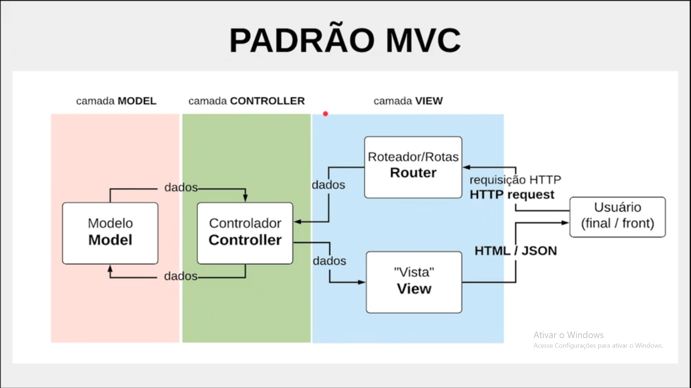

# Arquitetura do projeto

## :earth_americas: Pacotes instalados no projeto

+ npm ---------------- Comando de instalação ` npm init -y` :heavy_check_mark:
+ express ------------ Comando de instalação `npm stall express` :heavy_check_mark:
+ body-parse --------- Comando de instalação `npm install body-parse` :heavy_check_mark:
+ nodemon ------------ Comando de instalação `npm install --save-dev nodemon` :heavy_check_mark:
+ mysql2 ------------- Comando de instalação `npm install mysql2` :heavy_check_mark:
+ sequelize ---------- Comando de instalação `npm install sequelize sequelize-cli path` :heavy_check_mark:
+ ESLint ------------- Comando de instalação `npm init @eslint/config` :heavy_check_mark:
+ criando um modelo -- Comando de instalação `npx sequelize-cli init` :heavy_check_mark:

+ npx eslint ./api --fix

## Comando para interagir com o banco de dados

+ comando para acessar o mysql  ----- ``sudo mysql -u root -p`` 
+ comando para criar uma tabela  -- ``create database nome_da_tabela`` 
+ selecionando database ---------- `use [nome do database];;`
+ data base ----------------------- `show databases;`
+ comando para mostrar as tabelas  ------ `show tables;`
+ comando para descrever tabelas  ------ `describe [nomeDaTabela]`
+ inserindo dados -- `insert into Pessoas (nome, ativo, email, role, createdAt, updatedAt) values ("Carla gomes", 1, "carla@carla.com", "estudante", NOW(), NOW());`

## Comando sequelize para interagir com o sequelize

+ Criando um modelo(tabela) --- `npx sequelize-cli model:create --name [nomeTabela] --attributes [xx:string]`;
+ Criando uma seeder --- `npx sequelize seed:generate --name demo-pessoa`;
+ comando para atualizar o banco  ------ `npx sequelize-cli db:migrate`
+ Comando para semear dados no banco --- `npx sequelize-cli db:seed:all`
+ Comando para desfazer tabelas --- `npx sequelize-cli db:seed:all`


``````
Exemplo para criação de uma tabela:

npx sequelize-cli model create --name Pessoas --attributes nome:string,ativo:boolean,em
ail:string,role:string

``````


## Conceituação

### O que é um ORM?

O ORM (Object-Relational Mapping) funcionam para facilitar o cotidiano de desenvolvimento. Dessa forma o Sequelize suporta diversos bancos de dados relacionais como PostgreSQL, MySQL, SQLite e MSSQL. Com o Sequelize, é possível mapear objetos do JavaScript para tabelas do banco de dados e realizar operações de CRUD (Create, Read, Update, Delete) utilizando apenas JavaScript, sem a necessidade de escrever queries em SQL.


## metodo associate

Esse método é onde ocorre as relações de cardinalidades, como por exemplo `muitos ára muitos`. Essas relações são feias através dos métodos:

+ A ``HasOne()`` Associação Um-para-Um
+ A ``BelongsTo()`` associação é usada no lado oposto de onde você usaria uma associação HasOne ou HasMany.
+ A ``HasMany()`` Associação um-para-muitos 
+ A ``BelongsToMany()`` Associação muitos para muitos 

+ Também vai ser preciso colocar 

## Normalização de tabela

Alguns jeitos de criar tabelas funcionam melhor do que outros, quando falamos de performance de banco, repetição desnecessária de informações, etc. O processo de otimizar as tabelas de acordo com a necessidade do negócio é o que chamamos de normalização.


## Migração

+ A migração em ORM se refere a alterações incrementais que podem ser rastreadas , como se fosse a linha do tempo de commits no guit por exemplo.
Os arquivos de migração são utilizados para comunicar ao banco a estrutura das tabelas, suas colunas e tipos de dados. O Sequelize utiliza estes arquivos somente quando rodamos o comando de migração 
(por exemplo, ``npx sequelize-cli db:migrate``).

+ Utilizamos o comando de migração no ORM para fazer alterações rastreáveis no banco. As migrações ficam indexadas em sequelizeMeta e podem ser revertidas, mas não é preciso desfazer a migração anterior para fazer uma nova alteração no banco, como adicionar uma coluna. É só rodar um novo comando de migração para adicionar as alterações.

+ Precisamos passar manualmente as referencias dos modelos nos arquivos de migrações como no exemplo:

``````
turma_id: {
				allowNull: false,//garante que o campo não será nulo,
				type: Sequelize.INTEGER,
				references: {model: 'Turmas', key: 'id'} 
			},
``````

+ Toda vez que criamos um modelo é criado um arquivo de migração.


## Singular e plural

Quando usamos ORMs (como o Sequelize) ou outros frameworks (como o Rails se estiver trabalhando com a linguagem Ruby) para trabalhar com os bancos de dados, o comportamento padrão dessas ferramentas é “pluralizar” automaticamente todos os nomes de tabelas. Ou seja, quando criamos a tabela Person (Pessoa em inglês) através do Sequelize, ele vai se conectar ao banco e criar a tabela com o nome de People (Pessoas em inglês). Isso vale para qualquer nome: Name (Nome) se torna Names (Nomes) e por aí vai.

Quando se trabalha com nomes em inglês isso não costuma ser um problema em si, pois a pessoa não precisa se preocupar em avisar ao Sequelize “olha, a tabela que eu chamei de Person você procura no banco como People, ok?”; o próprio ORM já faz essa conversão e sabe exatamente como transformar palavras em inglês do singular para o plural e vice-versa.

## O que são seeders?

Os seeds servem para termos dados iniciais no banco, normalmente dados de exemplo e/ou para teste. Quando você quiser desfazer essa operação para limpar esses dados do banco, pode rodar o comando:

``````
npx sequelize db:seed:undo

``````

+ IMPORTANTE: Os seeders precisam, ser criados respeitando as ordens da tabela, ou seja criando os seedrs das tabelas com as chaves primárias primeiro.

## Padrão MVC

MVC é um padrão de arquitetura, de desenvolvimento, que é uma sigla: 
“modelo”, “visão”, e “controlador”: 

``````
Model 
View 
Controller.

``````



## Criando tabelas através do sequelize

+ Para se criar um novo modelo basta usar o comando `npx sequelize-cli model:create --name [nomeTabela] --attributes [xx:string]`, lembrando que quando criamos uma tabela devemos inserir somentes os atributos digamos, naturais da tabela, ignorando as chaves estrangeiras e chave primária, pois são criadas pelo sequeliza de forma automáticas.

+ As tabelas precisam ser criadas nas seguintes ordens: Primeiro as entidades com chaves primárias, pelo motivo de que se não for dessa maneira, quando o sequelize rodar as migrações ele abará se perdendo.


